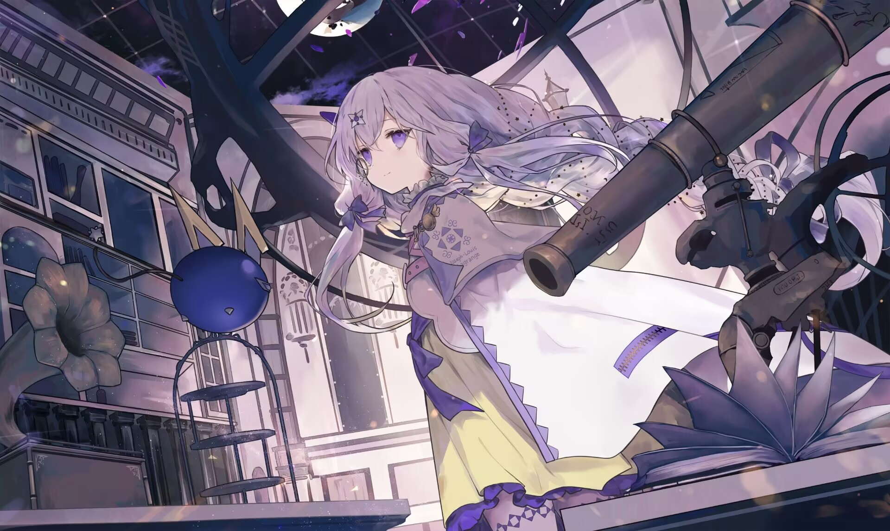

## Hi Welcome to my Profile , I'm Reslove

 -🎓A college student trying to study 
 -🤔Now learned ☁cloud copmuting 
 -😄Hobby:ACG astronomy video Rhythm game 
 -📫Reach me Email:2086321602@qq.com QQ:2086321602 
 -👏 Follow Me: 
 

  
  
  
  
  
  
  
  
  
  
  
 

 |  |

